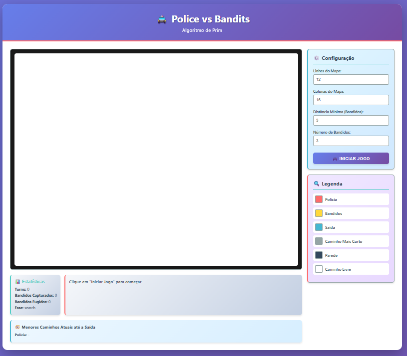
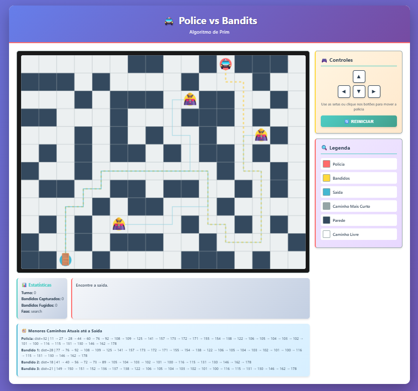
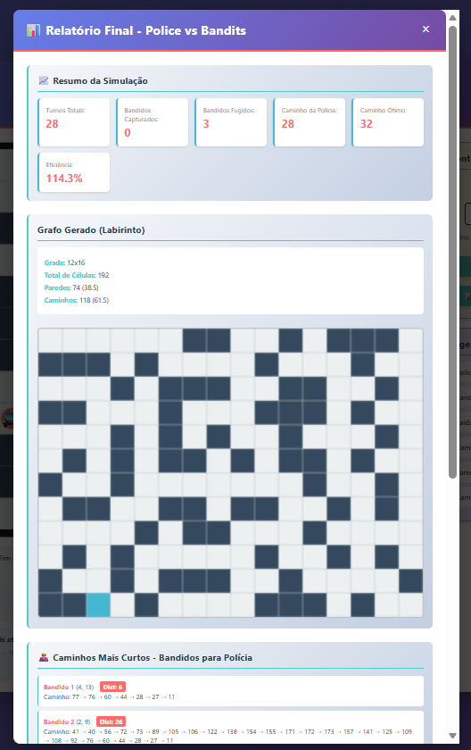
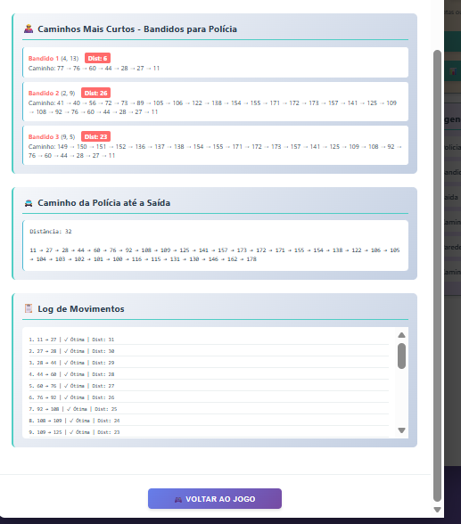

# Grafos1_PoliceVsBandits

Número da Lista: 50<br>
Conteúdo da Disciplina: Grafos 1<br>

## Aluno
| Matrícula | Aluno |
| -- | -- |
| 21/1031790 | Oscar de Brito |
| 21/1063013 | Renata Quadros Kurzawa |

## Vídeo de Apresentação
### Link do YouTube 
link: https://youtu.be/4YBEyfTHQzw

[](https://youtu.be/4YBEyfTHQzw)

## Sobre
PoliceVsBandits é um jogo com foco em conceitos de Grafos 1.

Objetivos do projeto:
- aplicar geração de mapa usando algoritmo de Prim;
- aplicar busca de caminhos mínimos no tabuleiro;
- simular perseguição e fuga entre polícia e bandidos com regras de distância mínima;
- gerar relatório final com métricas.

Como funciona:
1. Um mapa/labirinto é gerado automaticamente.
2. Polícia, saída e bandidos são posicionados no tabuleiro.
3. A cada turno, a polícia se move por teclado ou botões.
4. Os bandidos tentam fugir para a saída, priorizando menor caminho e respeitando distância mínima da polícia quando possível.
5. Ao final, o sistema gera um relatório com resumo da simulação, caminhos e informações do grafo.

## Screenshots

Exemplo de inclusão no README:






## Instalação
Linguagem: Python 3.10+<br>
Framework: Flask (backend) + HTML/CSS/JavaScript (frontend)<br>

Pré-requisitos:
- Python instalado;
- pip disponível;
- ambiente virtual recomendado.

Passo a passo:

```bash
# clonar o repositório
git clone <URL_DO_REPOSITORIO>
cd Grafos1_PoliceVsBandits

# criar e ativar ambiente virtual (Windows PowerShell)
python -m venv .venv
.venv\Scripts\Activate.ps1

# instalar dependências
pip install -r requirements.txt
```

## Uso
Com o ambiente virtual ativo:

```bash
python app.py
```

Depois, abra no navegador:

```text
http://localhost:5000
```

Fluxo recomendado:
1. Definir parâmetros (linhas, colunas, distância mínima e quantidade de bandidos).
2. Iniciar partida.
3. Mover a polícia e tentar interceptar os bandidos antes da fuga.
4. Ao finalizar a simulação, abrir o relatório final para análise dos caminhos e estatísticas.
